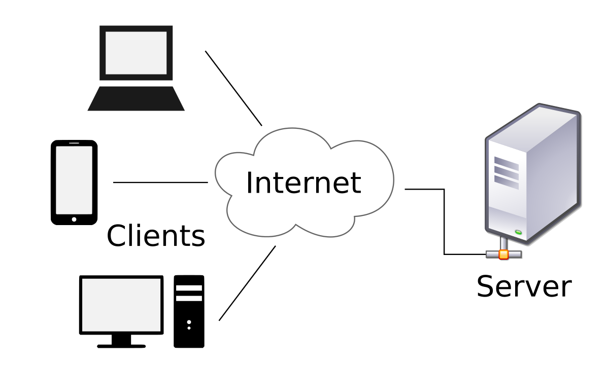

# Programmation Web

## Architecture Client Serveur

Historiquement, les premiers logiciels informatiques s'articulaient autour d'une architecture 100% locale. Dans cette architecture, l'ordinateur devait assumer tous les rôles: gestion de l'interface homme-machine (IHM), traitement de l'information, stockage de l'information, etc. Avec la multiplication des systèmes d'exploitation et le developpement rapide d'internet, cette architecture locale a vite montré ses limites. D'une part compte tenu de la multiplication des systèmes d'exploitation (MacOs, Windows, Linux, Unix), les developpeurs ne devaient plus programmer un logiciel mais **des** logiciels et fournir des mises à jour régulièrement. D'autre part avec le developpement d'Internet, les informations se sont progressivement déplacer sur le net dans de gigantesques bases de données partagées. Pour résoudre ces problèmes, une nouvelle architecture s'est imposée: l'architecture client-serveur.

Dans une architecture client-serveur, le client va principalement s'occuper de l'IHM. En fonction des actions de l'utilisateur, le client va envoyer des requêtes à un serveur web. Ce serveur va ensuite effectuer le traitement des requêtes, en interagissant si besoin avec une base de données. Enfin, le serveur va renvoyer le résultat des traitements au client. 

Pour programmer une application web, il est donc nécessaire de programmer conjointement un logiciel pour le client (gestion de l'IHM) et un logiciel pour le serveur (traitement et stockage de l'information). 

* Côté client. Quelque soit votre système d'exploitation, les interfaces homme-machine sont principalement programmées en HTML/CSS/JS. 
    * HTML: Gestion du fond (contenu)
    * CSS: Gestion de la forme (apparence graphique)
    * JS: Gestion des interactions.
Ces interfaces sont alors interpretées par un navigateur internet comme Chrome, Firefox, Safari, IE, etc.
* Côté serveur. Le traitement des informations peut être gêré par quasiment tous les langages de programmation. Toutefois, certains langages se sont démarqués en proposant des Frameworks spécialisés pour le web. Par exemple, citons le PHP (framework: Laravel ou Symfony), le Ruby (framework: ruby on rails) ou bien le Python. 

Dans ce tutoriel, nous allons utiliser le langage Python pour programmer les traitements de notre serveur. Par rapport aux langages PHP et Ruby, le Python possède une incroyable polyvalence. 

## Frameworks Python

Il existe plusieurs Framework web developpés en Python. 

* Django: [31000 stars](https://github.com/django/django) sur Github
* Flask: [31000 stars](https://github.com/pallets/flask) sur Github
* Tornado: [14000 stars](https://github.com/tornadoweb/tornado) sur Github
* Pyramid: [2500 stars](https://github.com/Pylons/pyramid) sur Github

Les deux frameworks les plus utilisés sont Django et Flask. Dans l'esprit, ces deux frameworks sont toutefois très différents. Django est un framework très complet qui intégre un grand nombre de fonctionnalités. Ce framework est utilisé entre autre par Instagram ou par Pinterest. A l'inverse, Flask est un framework beaucoup plus minimal. Ce micro-framework n'intègre que les fonctionnalités de base. Cependant ne vous trompez pas, Flask permet le developpement d'application web relativement complexe.

