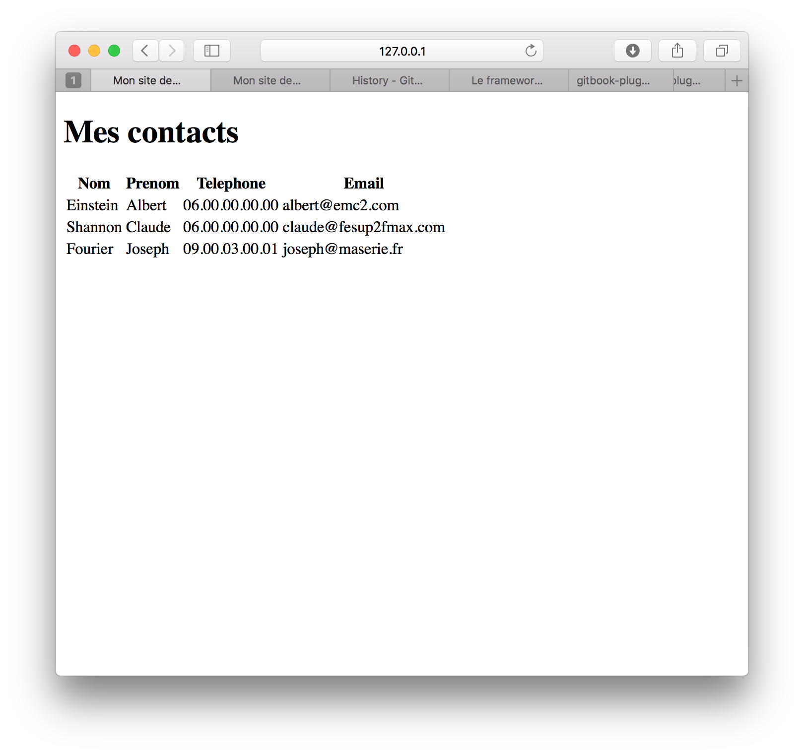

# Le micro framework Flask

<div>
 
</div>

<div style="text-align:center;">

</div>

## Contexte

Lors du développement d'une application web, il faut gérer des fonctionnalités très diverses telles que la gestion des requêtes http, leur routage, les interactions avec la base de données, l'authentification des utilisateurs, la protection du site vis à vis des requêtes malveillantes, le renvoi de pages html, etc. Le codage de l'ensemble de ses fonctionnalités peut rapidement devenir complexe. Pour aller plus vite (et éviter de réinventer la roue), il est préférable d'utiliser un framework web intégrant déjà l'ensemble de ses fonctionnalités.

## Principe 

> La Documentation de Flask est disponible à l'adresse: (http://flask.pocoo.org/docs/0.12/)


Flask est un framework web très léger. Pour développer une application web en Flask, il suffit de coder un fichier Python spécifiant:
* comment router les requêtes des clients (via le décorateur `@app.route(.)`)
* comment traiter les requêtes après routage (via une fonction Python).

Pour vérifier que Flask est bien installé, nous allons tout d'abord créer une application `server.py` permettant d'afficher dans une page Web  la chaîne de caractères "Hello World". Pour y arriver, nous allons inscrire le code Python suivant dans un fichier nommé `server.py`.

[import](./src/src1/server.py)

Les deux premières lignes permettent d'importer la librairie Flask et de créer votre application web. La 4ieme ligne est un décorateur  de fonction Python. Un décorateur de fonction est une fonction qui modifie le comportement d'une autre fonction. Ici, ce décorateur indique que les requêtes pointant vers l'url "/" doivent être traitées par la fonction `hello\_world`. La fonction `hello\_world` renvoie ici simplement la chaine de caractères "Hello, World!"

Pour lancer notre première application web, rien de plus simple !

1. Dans votre terminal, lancez les commandes suivantes

```
$ export FLASK_APP=server.py
$ flask run
```

Si tout se passe bien, Flask doit afficher les lignes suivantes sur votre terminal:

```
$ * Serving Flask app "server"
$ * Running on http://127.0.0.1:5000/ (Press CTRL+C to quit)
```

2. Pour tester votre application, ouvrez votre navigateur internet à l'adresse spécifiée par Flask (ici `http://127.0.0.1:5000/`). 

Si tout fonctionne bien, la page web doit alors afficher la chaine "Hello, World!".

## Première implémentation

Pour implémenter notre application, nous allons considérer que les contacts sont stockés dans une liste python nommée `contact_list`. Cette liste sera initialisée directement dans le fichier `server.py`.

Dans notre premier version de notre application, nous allons uniquement router l'url "/" vers une fonction `index()`. La fonction `index()` devra ensuite construire un tableau HTML (balise `<table>`) listant l'ensemble des élements contenus dans la variable `contact_list`.

[import](./src/src2/server.py)

L'image ci-dessous présente la première page de notre application.




