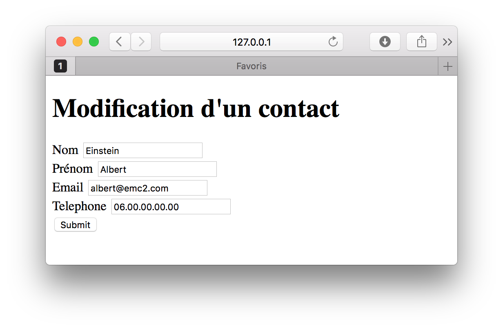

# Gestion des formulaires

Dans toutes les applications informatiques de gestion, le client peut consulter des informations mais également, si il en a l'autorisation, les éditer. L'ensemble des opérations réalisables est souvent désigné via l'acronyme **CRUD** (Create Read Update Delete). Dans cette partie, nous allons apprendre à gérer ces opérations avec le framework Flask.

## Principe

> La documentation HTML5 sur les formulaires est disponible à l'adresse: (https://www.w3schools.com/tags/tag_form.asp)

Pour l'instant, notre application web ne fait que transmettre des données aux clients. Dans la plupart des applications, les clients peuvent également transmettre des données au serveur via des formulaires HTML.

Un formulaire HTML est composé d'un ou plusieurs élements. Ceux-ci peuvent être des zones de texte, des boîtes de sélection, des boutons, des cases à cocher ou des boutons radio. La plupard du temps, un formulaire intègre également un bouton de soumission permettant de transmettre les données au serveur.



Pour réaliser un formulaire en HTML, il fait encapsuler un ensemble d'élements (`<input>`, `<select>`, etc) dans une balise `<form>`. 

```
<form action="#" method="get">
Nom: <input type="text" name="nom">
<input type="submit" value="Submit">
</form>
```

La balise `<form>` contient plusieurs attributs:
* L'attribut `action` indique à quelle adresse les données seront envoyées. En indiquant la valeur `"#"`, les données sont renvoyées à la même url.
* L'attribut `method` indique comment les données seront envoyées. Il existe deux methodes possibles: `get`et `post`. En utilisant la méthode `get`, les données seront envoyées via l'url. En utilisant la méthode `post`, les données seront envoyées dans le corps de la requête. En règle générale, il est recommandé d'utiliser la méthode `post` pour éviter de rendre visible les données des clients.

## Templates HTML

Dans notre application, nous allons utiliser plusieurs templates pour la création, la modification et la suppression des contacts. 


```
server.py
/templates
    base.html
    index.html
    form.html
    create.html
    update.html
    delete.html
```

### Fichier index.html

[import](./src/src4/templates/index.html)

### Fichier form.html

[import](./src/src4/templates/form.html)

### Fichier create.html

[import](./src/src4/templates/create.html)

### Fichier update.html

[import](./src/src4/templates/update.html)

### Fichier delete.html

[import](./src/src4/templates/delete.html)

## Application Web (fichier server.py)

[import](./src/src4/server.py)
